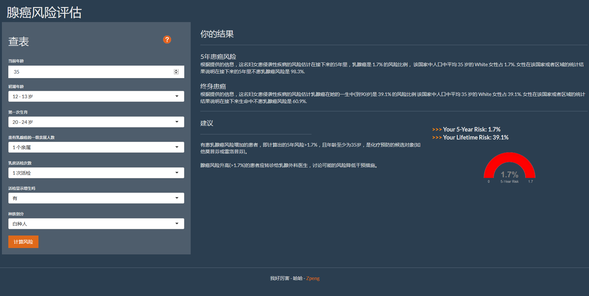

需要安装shiny包

选择镜像的时候选择美国区的，这样安装其中的:

install.packages('shiny')

install.packages('flexdashboard')

install.packages('shinythemes')

运行下面代码：

library(shiny)

library(flexdashboard)

library(shinythemes)

runApp('文件夹路径')

